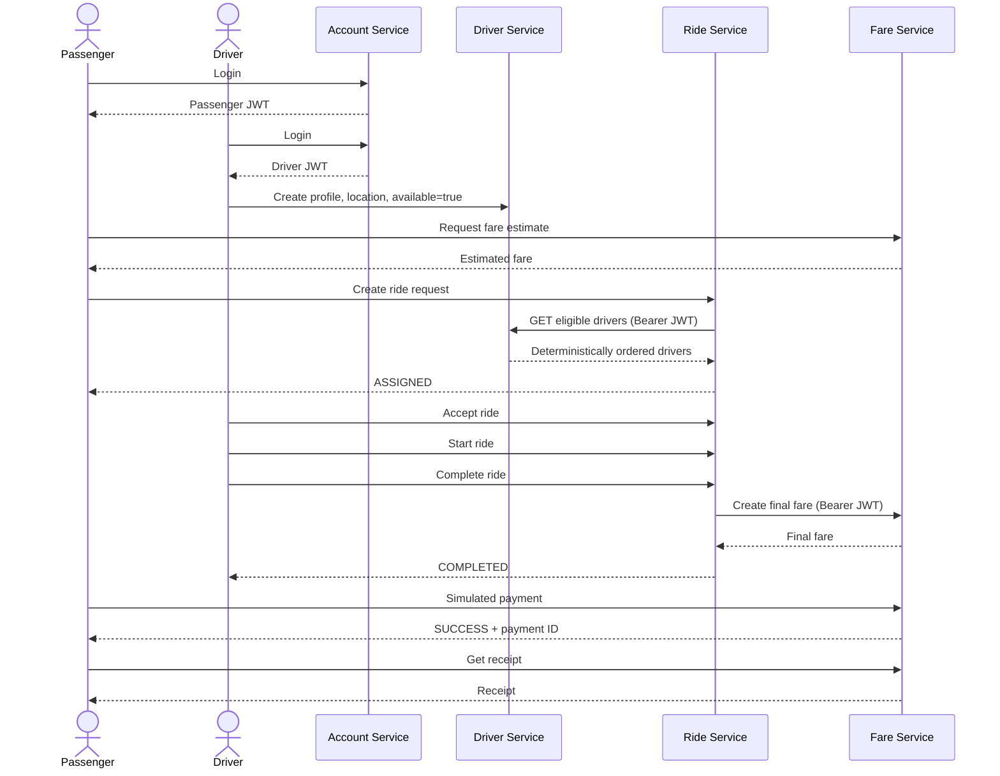

# End-to-end sequence

```mermaid
sequenceDiagram
  actor Passenger
  actor Driver
  participant Account as Account Service
  participant DriverSvc as Driver Service
  participant Ride as Ride Service
  participant Fare as Fare Service
  Passenger->>Account: Login
  Account-->>Passenger: Passenger JWT
  Driver->>Account: Login
  Account-->>Driver: Driver JWT
  Driver->>DriverSvc: Create profile, location, available=true
  Passenger->>Fare: Request fare estimate
  Fare-->>Passenger: Estimated fare
  Passenger->>Ride: Create ride request
  Ride->>DriverSvc: GET eligible drivers (Bearer JWT)
  DriverSvc-->>Ride: Deterministically ordered drivers
  Ride-->>Passenger: ASSIGNED
  Driver->>Ride: Accept ride
  Driver->>Ride: Start ride
  Driver->>Ride: Complete ride
  Ride->>Fare: Create final fare (Bearer JWT)
  Fare-->>Ride: Final fare
  Ride-->>Driver: COMPLETED
  Passenger->>Fare: Simulated payment
  Fare-->>Passenger: SUCCESS + payment ID
  Passenger->>Fare: Get receipt
  Fare-->>Passenger: Receipt
```

